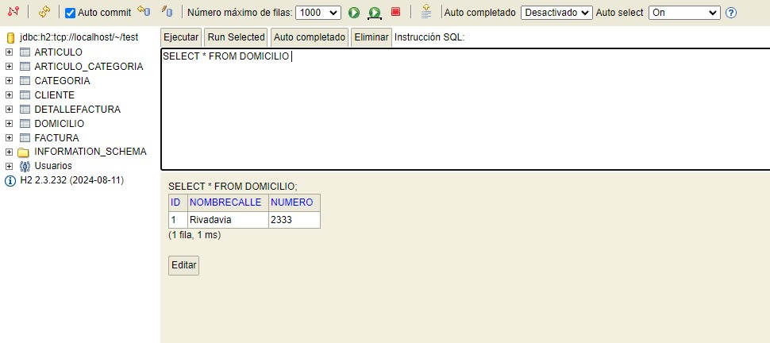

## Desarrollo de Sofware - Trabajo Practico JPA
## Autor

**Matias Fernández** - Legajo: **49483** - Comisión **3K10**
## Descripción del Proyecto
Este proyecto  El objetivo del proyecto es implementar un sistema de facturación utilizando **Java Persistence API (JPA)** e **Hibernate**, con enfoque en la persistencia de entidades y la gestión de relaciones entre ellas.
### 1. Introducción y Conceptos
Se introduce el uso de **JPA** como API para la gestión de la persistencia de objetos Java en una base de datos relacional, y **Hibernate** como su implementación más utilizada. Se exploran los beneficios de utilizar un ORM (Object-Relational Mapping) y se presenta el concepto de entidades y sus relaciones.

### 2. Creación de Entidades
Se crean varias entidades que forman la base del sistema de facturación:
- **Factura**
- **Cliente**
- **Artículo**
- **Categoría**
- **DetalleFactura**

Estas entidades se configuran para que puedan ser gestionadas por el EntityManager y almacenadas en la base de datos.

Además, el sistema permite gestionar la persistencia de las entidades mencionadas. Este proyecto utiliza la base de datos **H2** para desarrollo y pruebas, lo que facilita la persistencia de datos en memoria. Las relaciones entre las entidades están modeladas siguiendo conceptos de bases de datos relacionales, y se exploran diferentes tipos de relaciones entre entidades utilizando JPA e Hibernate.

### 3. Relaciones entre entidades
Los tipos de relaciones que trabajamos en este proyecto son:
##### @OneToOne unidireccional y bidireccional
Se implementan relaciones `@OneToOne` para modelar asociaciones entre entidades donde un registro de una tabla está asociado a un único registro en otra tabla, como la relación entre **Cliente** y **Domicilio**.

##### @ManyToOne unidireccional y bidireccional
Se implementan relaciones `@ManyToOne` para modelar asociaciones donde varios registros de una tabla pueden estar asociados a un único registro de otra tabla, como la relación entre **Factura** y **Cliente**.

##### @OneToMany unidireccional y bidireccional
Se utiliza `@OneToMany` para modelar asociaciones donde un registro de una tabla está asociado a varios registros de otra tabla, como la relación entre **Cliente** y sus **Facturas**. Se exploran ambas variantes (unidireccional y bidireccional).

##### @ManyToMany unidireccional y bidireccional
Se implementan relaciones `@ManyToMany` para modelar asociaciones donde varios registros de una tabla pueden estar asociados a varios registros de otra tabla, como la relación entre **Artículo** y **Categoría**.


### 4. Persistencia de Factura con Todos sus Datos
Finalmente, se demuestra cómo persistir una **Factura** con todas sus asociaciones, incluyendo **Cliente**, **Artículos**, **Categorías**, y **Detalles de Factura**, gestionando la transacción de manera segura y eficiente.

## Capturas de la Base de Datos H2
### Tabla Articulo

### Tabla ArticuloCategoria

### Tabla Categoria

### Tabla Cliente

### Tabla DetalleFactura

### Tabla Domicilio

### Tabla Factura

## Características Técnicas

### Tecnologías Utilizadas
- **Java**: Lenguaje de programación principal.
- **JPA**: Para la gestión de la persistencia.
- **Hibernate**: Implementación de JPA.
- **H2 Database**: Base de datos embebida para desarrollo.
- **Lombok**: Para la generación de código boilerplate como getters, setters, constructores, etc.
- **JUnit**: Para realizar pruebas unitarias.

### Dependencias del Proyecto

```groovy
plugins {
    id 'java'
}

group 'org.example'
version '1.0-SNAPSHOT'

repositories {
    mavenCentral()
}

dependencies {
    implementation 'org.hibernate:hibernate-core:5.6.10.Final'
    implementation 'org.hibernate:hibernate-envers:5.6.10.Final'
    implementation 'org.hibernate:hibernate-entitymanager:5.6.10.Final'
    implementation 'org.projectlombok:lombok:1.18.24'
    annotationProcessor 'org.projectlombok:lombok:1.18.24'
    implementation 'com.fasterxml.jackson.core:jackson-databind:2.13.3'
    runtimeOnly 'com.h2database:h2:2.3.232'
    testImplementation 'org.junit.jupiter:junit-jupiter-api:5.8.1'
    testRuntimeOnly 'org.junit.jupiter:junit-jupiter-engine:5.8.1'
}

test {
    useJUnitPlatform()
}
```

### Archivo `persistence.xml`

```xml
<?xml version="1.0" encoding="UTF-8"?>
<persistence xmlns="http://xmlns.jcp.org/xml/ns/persistence"
             xmlns:xsi="http://www.w3.org/2001/XMLSchema-instance"
             xsi:schemaLocation="http://xmlns.jcp.org/xml/ns/persistence http://xmlns.jcp.org/xml/ns/persistence/persistence_2_2.xsd"
             version="2.2">
    <persistence-unit name="example-unit" transaction-type="RESOURCE_LOCAL">
        <class>org.example.Articulo</class>
        <class>org.example.Categoria</class>
        <class>org.example.Cliente</class>
        <class>org.example.DetalleFactura</class>
        <class>org.example.Domicilio</class>
        <class>org.example.Factura</class>
        <properties>
            <property name="javax.persistence.jdbc.driver" value="org.h2.Driver"/>
            <property name="javax.persistence.jdbc.url" value="jdbc:h2:tcp://localhost/~/test"/>
            <property name="javax.persistence.jdbc.user" value="sa"/>
            <property name="javax.persistence.jdbc.password" value=""/>
            <property name="hibernate.show_sql" value="true"/>
            <property name="hibernate.dialect" value="org.hibernate.dialect.H2Dialect"/>
            <property name="hibernate.hbm2ddl.auto" value="create"/>
        </properties>
    </persistence-unit>
</persistence>
```

### Ejecución del Proyecto

Para ejecutar el proyecto, sigue los siguientes pasos:

1. Clona el repositorio:
   ```bash
   git clone https://github.com/matiFernandezz/JPAMatiasFernandez
   cd JPAMatias
   ```

2. Compila el proyecto:
   ```bash
   ./gradlew build
   ```

3. Ejecuta el proyecto:
   ```bash
   ./gradlew run
   ```

El sistema iniciará y se encargará de persistir los datos de las facturas, clientes, artículos y categorías en la base de datos **H2**.

## Consideraciones

- La base de datos **H2** está configurada para uso en desarrollo.
- Las transacciones están gestionadas manualmente para garantizar la consistencia en caso de errores.


